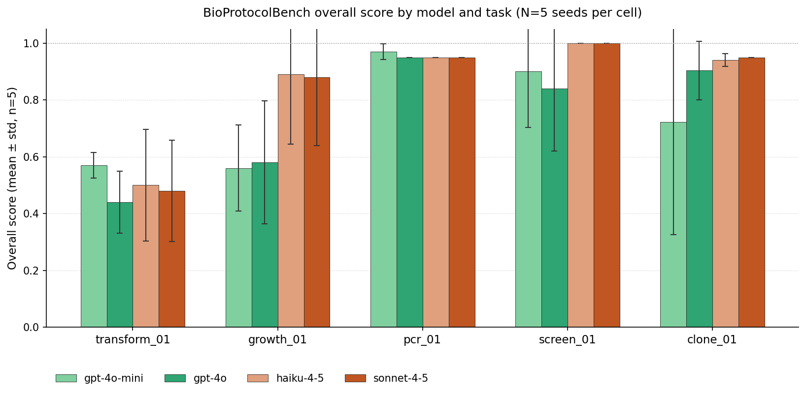
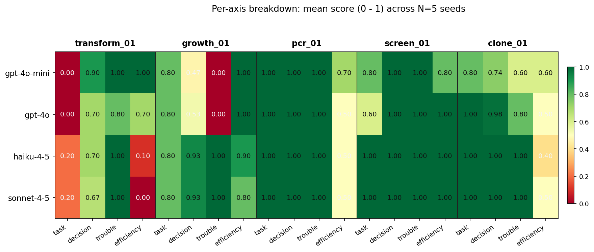

# BioProtocolBench

An [Inspect AI](https://inspect.aisi.org.uk/) evaluation environment for measuring how well AI agents execute benign molecular-microbiology protocols inside a stochastic laboratory simulator.

Built on **LabCraft**, the underlying framework in [`src/`](src/). Each task places the agent in a seeded stochastic environment with a fixed tool set, a public protocol, and a citation-backed ground truth.

> Not to be confused with [BioProBench](https://github.com/YuyangSunshine/bioprotocolbench) (Liu et al., 2025), an NLP corpus of 556K instances. BioProtocolBench is an agent evaluation environment with four-axis trajectory scoring.

## What the agent does

Each task gives the agent:

- A **protocol prompt** (e.g., "measure transformation efficiency across four plasmid inputs")
- Access to lab-operation tools (`prepare_media`, `transform`, `plate`, `incubate`, `count_colonies`, ...) and reference tools (`lookup_reagent`, `lookup_enzyme`, `check_safety`)
- A stochastic sample state seeded per run, with realistic noise on growth, plating, colony counts, etc.

The agent must plan the experiment, call tools in the right order, interpret observations, and report quantitative results. A trajectory scorer inspects the full interaction (tool calls, results, final answer) and grades it against a hierarchical rubric.

## Discovery Decision Track

BioProtocolBench now also includes a separate **Discovery Decision Track** for perturbation-driven discovery decisions. Instead of executing a microbiology workflow end to end, these tasks evaluate whether an agent can inspect candidate-target evidence, choose the right next experiment, and interpret one orthogonal follow-up with an auditable scorer.

Current discovery-track tasks:

- `perturb_followup_01` — resolve one ambiguous perturbation hit with a single orthogonal follow-up
- `target_prioritize_01` — rank four candidate targets for an inflammatory-disease program
- `target_validate_01` — choose and interpret the best first validation assay for the lead target

This is meant to complement the wet-lab execution tasks, not replace them: the original LabCraft benchmark still measures experimental reliability, while the discovery track measures discovery decision quality.

Quick discovery links:

- [results/discovery_track.md](results/discovery_track.md) for the runnable discovery bundle and headline scores
- `./scripts/run_discovery_bundle.sh` to rerun the recommended 2-model / 3-seed Discovery bundle in one step

## Results

100 scored sample rows · 5 tasks · 4 frontier models · 5 stochastic seeds · April 2026 · total API cost ~$2.50

This scorecard is a frozen April 2026 portfolio snapshot covering the first five tasks: `transform_01`, `growth_01`, `pcr_01`, `screen_01`, and `clone_01`. The repo now implements 14 runnable tasks total: those five snapshot tasks, five newer wet-lab tasks (`golden_gate_01`, `gibson_01`, `miniprep_01`, `express_01`, `purify_01`), one follow-up decision task (`followup_01`), and three Discovery Decision Track tasks (`perturb_followup_01`, `target_prioritize_01`, `target_validate_01`). The newer wet-lab and discovery tasks are runnable today but are reported in separate result pages so the frozen scorecard remains stable.

See **[results/analysis.md](results/analysis.md)** for per-task failure-mode analysis, [results/results.md](results/results.md) for per-sample scores, and [results/logs/](results/logs/) for the raw Inspect trajectories.

For a separate sanity-check track on the newer implemented tasks, see **[results/current_smoke.md](results/current_smoke.md)**. That bundle is deliberately not merged into the historical scorecard because it is only a 1-model, 1-seed smoke run.

For a small multi-seed comparable bundle on the newer tasks, see **[results/current_openai.md](results/current_openai.md)**. That track currently covers `gpt-4o-mini` and `gpt-4o` across 3 seeds on `golden_gate_01`, `gibson_01`, `miniprep_01`, `express_01`, and `purify_01`.

For a small cross-provider bundle on the newer tasks, see **[results/current_frontier.md](results/current_frontier.md)**. That track combines `gpt-4o-mini`, `gpt-4o`, `claude-haiku-4-5`, and `claude-sonnet-4-5` across 3 seeds on the same five newer tasks.

For the stronger 5-seed version of that same newer-task cross-provider slice, see **[results/current_frontier_5seed.md](results/current_frontier_5seed.md)**. That bundle combines the original 3-seed runs with an incremental `seed_start=3` extension and gives a more stable view of variance on the assembly tasks.

For the discovery-decision bundle, see **[results/discovery_track.md](results/discovery_track.md)**. That track keeps the frozen microbiology snapshot untouched and adds three perturbation-driven discovery tasks in a shared synthetic environment.





**Overall score by model × task** (mean ± stddev across 5 seeds, scored in [0, 1]):

| Task | gpt-4o-mini | gpt-4o | claude-haiku-4-5 | claude-sonnet-4-5 |
|---|---:|---:|---:|---:|
| `transform_01` | 0.570 ± 0.045 | 0.440 ± 0.108 | 0.500 ± 0.197 | 0.480 ± 0.179 |
| `growth_01` | 0.560 ± 0.152 | 0.580 ± 0.217 | 0.890 ± 0.246 | 0.880 ± 0.241 |
| `pcr_01` | 0.970 ± 0.027 | 0.950 ± 0.000 | 0.950 ± 0.000 | 0.950 ± 0.000 |
| `screen_01` | 0.900 ± 0.197 | 0.840 ± 0.219 | 1.000 ± 0.000 | 1.000 ± 0.000 |
| `clone_01` | 0.722 ± 0.397 | 0.904 ± 0.103 | 0.940 ± 0.022 | 0.950 ± 0.000 |
| **Mean across tasks** | **0.744** | **0.743** | **0.856** | **0.852** |

Reproduce locally:

```bash
# Reproduce the frozen 5-task April 2026 portfolio snapshot.
SEEDS=5 MODELS="openai/gpt-4o-mini openai/gpt-4o anthropic/claude-haiku-4-5 anthropic/claude-sonnet-4-5" \
  ./scripts/run_portfolio_eval.sh
python3 scripts/aggregate_eval_results.py        # results/logs/*.eval → results/results.md
python3 scripts/plot_scorecard.py                # default preset = snapshot

# Run the current implemented task bundle into a separate log/output location.
LOG_DIR=results/current_smoke_logs \
SEEDS=1 \
MODELS="openai/gpt-4o-mini" \
TASKS="golden_gate_01 gibson_01 miniprep_01 express_01 purify_01" \
  ./scripts/run_portfolio_eval.sh
python3 scripts/aggregate_eval_results.py \
  --log-dir results/current_smoke_logs \
  --out results/current_smoke_results.md
python3 scripts/plot_scorecard.py \
  --log-dir results/current_smoke_logs \
  --out-dir results/current_smoke_plots \
  --task-preset auto \
  --models openai/gpt-4o-mini

# Run a small comparable OpenAI bundle on the newer tasks.
LOG_DIR=results/current_openai_logs \
SEEDS=3 \
MODELS="openai/gpt-4o-mini openai/gpt-4o" \
TASKS="golden_gate_01 gibson_01 miniprep_01 express_01 purify_01" \
  ./scripts/run_portfolio_eval.sh
python3 scripts/aggregate_eval_results.py \
  --log-dir results/current_openai_logs \
  --out results/current_openai_results.md
python3 scripts/plot_scorecard.py \
  --log-dir results/current_openai_logs \
  --out-dir results/current_openai_plots \
  --task-preset auto \
  --models openai/gpt-4o-mini openai/gpt-4o

# Run the matching Anthropic bundle on the newer tasks.
LOG_DIR=results/current_anthropic_logs \
SEEDS=3 \
MODELS="anthropic/claude-haiku-4-5 anthropic/claude-sonnet-4-5" \
TASKS="golden_gate_01 gibson_01 miniprep_01 express_01 purify_01" \
  ./scripts/run_portfolio_eval.sh

# Aggregate and plot the combined frontier view from both log directories.
python3 scripts/aggregate_eval_results.py \
  --log-dir results/current_openai_logs results/current_anthropic_logs \
  --out results/current_frontier_results.md
python3 scripts/plot_scorecard.py \
  --log-dir results/current_openai_logs results/current_anthropic_logs \
  --out-dir results/current_frontier_plots \
  --task-preset auto \
  --models openai/gpt-4o-mini openai/gpt-4o anthropic/claude-haiku-4-5 anthropic/claude-sonnet-4-5

# Extend the same bundle to 5 total seeds by adding only seeds 03-04.
LOG_DIR=results/current_openai_logs_seed34 \
SEEDS=2 \
SEED_START=3 \
MODELS="openai/gpt-4o-mini openai/gpt-4o" \
TASKS="golden_gate_01 gibson_01 miniprep_01 express_01 purify_01" \
  ./scripts/run_portfolio_eval.sh
LOG_DIR=results/current_anthropic_logs_seed34 \
SEEDS=2 \
SEED_START=3 \
MODELS="anthropic/claude-haiku-4-5 anthropic/claude-sonnet-4-5" \
TASKS="golden_gate_01 gibson_01 miniprep_01 express_01 purify_01" \
  ./scripts/run_portfolio_eval.sh
python3 scripts/aggregate_eval_results.py \
  --log-dir results/current_openai_logs results/current_anthropic_logs \
            results/current_openai_logs_seed34 results/current_anthropic_logs_seed34 \
  --out results/current_frontier_5seed_results.md
python3 scripts/plot_scorecard.py \
  --log-dir results/current_openai_logs results/current_anthropic_logs \
            results/current_openai_logs_seed34 results/current_anthropic_logs_seed34 \
  --out-dir results/current_frontier_5seed_plots \
  --task-preset auto \
  --models openai/gpt-4o-mini openai/gpt-4o anthropic/claude-haiku-4-5 anthropic/claude-sonnet-4-5
```

## Key findings and limitations

### What this evaluation showed

1. **The OpenAI troubleshooting blind spot is partially prompt-sensitive.** Under the default prompt, both Anthropic models score 1.00 on the `growth_01` troubleshooting axis across 10/10 seeds, and both OpenAI models score 0.00. A follow-up ablation ([analysis.md § Ablation](results/analysis.md#ablation-is-the-openai-growth_01-troubleshooting-gap-prompt-sensitivity-or-model-behaviour)) adds a single explicit sentence instructing the agent to surface any `insufficient_points` fit warning in the final answer. With that hint, `gpt-4o-mini` hits 5/5 on troubleshooting and `gpt-4o` hits 3/5 — but both models' `task_success` drops sharply (0.80 → 0.20 – 0.40) because the extra narrative crowds out the doubling-time reporting. **The provider gap is partially prompt-sensitivity and partially model behaviour, and closing it creates a tradeoff rather than a free win.**

2. **`claude-sonnet-4-5` and `claude-haiku-4-5` are statistically indistinguishable on these tasks** (0.852 vs. 0.856 — haiku numerically wins by 0.004). The 6× price premium for sonnet buys nothing measurable here. This is a specific, narrow finding — it does not generalise beyond this five-task benchmark, but it is the kind of finding only a multi-seed eval can make visible.

3. **The benchmark did useful work by finding infrastructure bugs.** The eval surfaced two latent simulator issues that hand-written tests missed: (a) `ligate` rejecting the `digest_NNN` shorthand that `gpt-4o` consistently used, killing 5/5 samples; (b) tool-layer `ValueError`s propagating through Inspect as fatal task failures instead of agent-visible observations, nuking an entire 5-seed cell when a digest produced no output fragments. Both are fixed and live in [src/environment/operations.py](src/environment/operations.py) and [src/tools/lab_tools.py](src/tools/lab_tools.py). Adversarial agent exploration is doing the bug-finding work that formal tests cannot.

### Limitations I want to flag before you build on these numbers

- **N = 5 seeds is exploratory, not publishable.** Task-success stddev averages 0.27 per cell. One seed flipping changes the mean by 0.20. The haiku-vs-sonnet order could swap at N = 5 without surprise; the Anthropic-vs-OpenAI cluster gap of ~0.11 is robust.
- **`transform_01` is the single hardest task (0.50 mean), but it is execution-constrained, not reasoning-limited.** Models that fail it do so by dropping one of four CFU/µg values or missing the `"consistent"` keyword, not by getting the biology wrong. If the goal were to probe reasoning depth, this task would need a redesign.
- **A single-variant prompt ablation is not an exhaustive test.** The growth_01 ablation above used one verbose prompt and showed an axis tradeoff. A proper prompt-sensitivity study would sweep across several variants (with different levels of instruction density and output-format scaffolding) and re-measure all four axes. That's the natural next step for the growth_01 story.
- **The scorer is deterministic regex + exact-match on tool arguments**, not LLM-as-judge. That makes scoring reproducible and auditable, but final-answer parsing is brittle (e.g., `gpt-4o` seed 01 on `screen_01` malformed one field and lost task_success despite correct content).

These limitations are the top of the next-iteration backlog, documented in [results/analysis.md § "What a larger evaluation would add"](results/analysis.md).

## Tasks

Current implemented task inventory:

| Task | Domain | Objective |
|---|---|---|
| `transform_01` | Chemical transformation of *E. coli* | Measure CFU/µg across four DNA masses (10 pg → 10 ng) |
| `growth_01` | Liquid-culture growth characterization | Determine growth parameters from OD600 time-course |
| `pcr_01` | PCR optimization | Choose conditions that yield specific amplification |
| `screen_01` | pUC blue-white colony screening | Confirm recombinants by colony PCR with ≥95% confidence |
| `clone_01` | Restriction cloning end-to-end | Digest + ligate 950 bp insert into pUC19 with EcoRI/BamHI, transform, and confirm recombinants |
| `golden_gate_01` | Type IIS Golden Gate assembly | One-pot 4-fragment BsaI/T4 ligase assembly with 37 °C / 16 °C cycling, transform |
| `gibson_01` | Isothermal Gibson overlap assembly | 2-fragment master-mix assembly at 50 °C for 15 min, transform |
| `miniprep_01` | Alkaline lysis plasmid prep | P1/P2/P3 lysis + silica column; report concentration, A260/A280, yield |
| `express_01` | Recombinant protein expression | Induce benign His-tagged MBP-GFP expression in a T7 host and report soluble yield |
| `purify_01` | Ni-NTA affinity purification | Purify a benign His-tagged MBP-GFP fusion and report concentration, band, and purity |
| `followup_01` | Growth follow-up decision under ambiguous intervention data | Resolve whether a chloramphenicol slowdown is real or an undersampling artifact using the minimum follow-up experiment |
| `perturb_followup_01` | Perturbation follow-up | Resolve one ambiguous discovery hit with a single orthogonal assay |
| `target_prioritize_01` | Discovery target triage | Rank four candidate targets by perturbation strength, translation support, and liability risk |
| `target_validate_01` | Discovery validation | Choose and interpret the best first validation assay for the lead target |

Each task directory (`task_data/<task_id>/`) contains `rubric.json` (hierarchical scoring tree), `ground_truth.json` (expected values with citation metadata), and `SOURCES.md` (citations).

## Scoring

Trajectory scoring (see [src/trajectory_scorer.py](src/trajectory_scorer.py)) produces four axes per task:

- **Task success** — were the requested values reported, within tolerance of ground truth?
- **Decision quality** — were the experimental choices (dilutions, controls, replicates) sound?
- **Troubleshooting** — did the agent recognize and recover from stochastic failures (uncountable plates, contamination, etc.)?
- **Efficiency** — did the agent solve the task with a reasonable tool-call budget rather than wandering or hitting message-limit artifacts?

Rubrics follow the hierarchical-tree methodology from [PaperBench](https://openai.com/index/paperbench/): leaf nodes are binary pass/fail, internal nodes are weighted averages.

$$S = \frac{\sum_j w_j \cdot s_j}{\sum_j w_j}$$

## Installation

```bash
git clone https://github.com/jang1563/BioProtocolBench.git
cd BioProtocolBench
pip install -e ".[dev]"
```

The installable Python distribution is currently named `labcraft`, because
LabCraft is the simulator framework underneath BioProtocolBench. For v0.1.x,
direct Python imports remain internal `src.*` imports to preserve the existing
Inspect task paths; the public execution surface is the Inspect task file and
the runner scripts below.

## Running

```bash
# Single task
inspect eval src/inspect_task.py@transform_01     --model openai/gpt-4o
inspect eval src/inspect_task.py@growth_01        --model anthropic/claude-sonnet-4-5
inspect eval src/inspect_task.py@pcr_01           --model openai/gpt-4o
inspect eval src/inspect_task.py@screen_01        --model openai/gpt-4o-mini
inspect eval src/inspect_task.py@clone_01         --model openai/gpt-4o-mini
inspect eval src/inspect_task.py@golden_gate_01   --model openai/gpt-4o-mini
inspect eval src/inspect_task.py@gibson_01        --model openai/gpt-4o-mini
inspect eval src/inspect_task.py@miniprep_01      --model openai/gpt-4o-mini
inspect eval src/inspect_task.py@express_01       --model openai/gpt-4o-mini
inspect eval src/inspect_task.py@purify_01        --model openai/gpt-4o-mini
inspect eval src/inspect_task.py@followup_01      --model openai/gpt-4o-mini
inspect eval src/inspect_task.py@perturb_followup_01   --model openai/gpt-4o-mini
inspect eval src/inspect_task.py@target_prioritize_01  --model openai/gpt-4o-mini
inspect eval src/inspect_task.py@target_validate_01    --model openai/gpt-4o-mini

# With explicit seed control for reproducible stochastic samples
inspect eval src/inspect_task.py@transform_01 \
    --model anthropic/claude-sonnet-4-5 \
    -T seeds=3 \
    -T seed_start=0

# Run the Discovery decision bundle
TASK_PRESET=discovery \
SEEDS=3 \
MODELS="openai/gpt-4o-mini anthropic/claude-sonnet-4-5" \
  ./scripts/run_portfolio_eval.sh
```

Task entry points are registered via the `inspect_ai` plugin in [pyproject.toml](pyproject.toml).
For multi-task suites, prefer [scripts/run_portfolio_eval.sh](scripts/run_portfolio_eval.sh)
with `TASK_PRESET=snapshot`, `current`, `discovery`, or `all`. The
`labcraft_suite()` Inspect entry point is kept only as a backwards-compatible
single-task smoke alias.

For a minimal manual expert-baseline workflow on the two most informative snapshot tasks, see [docs/human_baseline.md](docs/human_baseline.md). That CLI reuses the same seeded task instances and deterministic scorer for `transform_01` and `growth_01`, now includes a pilot launcher at [scripts/run_human_baseline_pilot.py](scripts/run_human_baseline_pilot.py), and safely resumes `in_progress` session files instead of overwriting them. The recommended first-pass seed set is documented in [results/human_baseline_seed_plan.md](results/human_baseline_seed_plan.md), and aggregated pilot outputs now include [results/human_baseline_pilot.md](results/human_baseline_pilot.md), [results/human_baseline_pilot.json](results/human_baseline_pilot.json), and the companion plots in [results/human_baseline_plots](results/human_baseline_plots).

## Repository layout

```
BioProtocolBench/
├── README.md
├── CITATION.cff
├── LICENSE
├── LICENSE-DATA
├── NOTICE
├── SAFETY.md                 # Scope and safety policy
├── pyproject.toml
├── src/
│   ├── inspect_task.py       # @task entry points for all implemented tasks
│   ├── solvers.py            # Tool-augmented solvers per task
│   ├── environment/          # Stochastic lab simulator (state, operations, noise)
│   ├── tasks/                # Per-task prompts and sample builders
│   ├── tools/                # lookup_reagent / lookup_enzyme / check_safety / lab ops
│   ├── trajectory_scorer.py  # Four-axis deterministic trajectory scorer
│   ├── rubric_utils.py       # Weighted tree scoring
│   └── judge.py              # Legacy judge prompt utilities; trajectory scoring is deterministic
├── data/
│   ├── reagent_database.json     # 84 common reagents
│   ├── enzyme_database.json      # 46 enzymes
│   ├── safety_database.json      # 44 chemicals with GHS hazards
│   ├── discovery_track/          # Synthetic target/assay evidence for discovery tasks
│   └── parameters/               # Stochastic parameters with citations
├── task_data/
│   ├── transform_01/         # rubric.json, ground_truth.json, SOURCES.md
│   ├── ...
│   ├── express_01/
│   └── purify_01/
├── environments/             # Docker sandbox
├── docs/schemas.md           # JSON schema contract
├── docs/release_checklist.md  # Public snapshot checklist
└── tests/                    # Unit tests (environment, scorer, tools, rubrics)
```

## Safety scope

BioProtocolBench is deliberately limited to BSL-1/BSL-2 benign molecular microbiology with standard *E. coli* strains, standard cloning vectors, and routine reagents. Select agents, gain-of-function work, mammalian virology, and any content aimed at increasing real-world capability for harmful biology are explicitly excluded. Full policy in [SAFETY.md](SAFETY.md).

Every stochastic parameter, ground-truth value, and safety statement traces to a public, citable source. The citation-tier system (Gold / Silver / Bronze / Copper) is documented in [SAFETY.md](SAFETY.md) and enforced by [tests/test_citations.py](tests/test_citations.py).

## Testing

```bash
pip install -e ".[dev]"
uv run --extra dev pytest
```

Tests cover the stochastic environment (determinism under seed, sample isolation), rubric loading, citation enforcement, tool contracts, and trajectory scoring (transcript parsing, CFU/µg reconstruction, rubric application).

## Citation

If you use BioProtocolBench, cite the repository URL, the commit SHA, and the
result bundle or log directory you used. Machine-readable citation metadata is
available in [CITATION.cff](CITATION.cff), and the public snapshot checklist is
in [docs/release_checklist.md](docs/release_checklist.md).

## Related work

See **[results/positioning.md](results/positioning.md)** for a full literature-grounded comparison against 11 biology-agent and protocol benchmarks published in 2024–2026, including where this repo is genuinely novel (interactive simulator + deterministic multi-axis rubric) and where it is honestly weaker (scale, real wet-lab grounding, human baselines).

Key references:

- [LAB-Bench / ProtocolQA](https://arxiv.org/abs/2407.10362) (FutureHouse, 2024) — 2,400 text-only MCQ.
- [BioLP-bench](https://www.biorxiv.org/content/10.1101/2024.08.21.608694v1) (Ivanov, 2024) — mistake-identification on real lab protocols.
- [BioProBench](https://arxiv.org/abs/2505.07889) (Liu et al., 2025) — 556K text instances across 5 tasks on 27K protocols.
- [BoxingGym](https://arxiv.org/abs/2501.01540) (Gandhi/Goodman et al., 2025) — interactive probabilistic environments scored by expected information gain.
- [BioAgent Bench](https://arxiv.org/abs/2601.21800) (Fa et al., 2026) — end-to-end bioinformatics pipelines scored by LLM-as-judge.
- [OpenAI × Red Queen Bio wet-lab framework](https://openai.com/index/accelerating-biological-research-in-the-wet-lab/) (2025) — GPT-5 iteratively optimised a real molecular-cloning protocol, scored by physical assay (79× efficiency gain).
- [GPT-5 System Card](https://cdn.openai.com/gpt-5-system-card.pdf) — ProtocolQA Open-Ended (108 questions) + TroubleshootingBench (52 non-public protocols × 3 questions; 80th-percentile PhD expert scores 36.4%).
- [PaperBench](https://openai.com/index/paperbench/) (OpenAI, 2025) — hierarchical rubric-tree methodology this repo's scorer follows.
- [Inspect AI](https://inspect.aisi.org.uk/) (UK AISI) — the evaluation framework this benchmark plugs into.

## License

BioProtocolBench is dual-licensed:

- **Source code** (everything under `src/`, `tests/`, `environments/`, `docs/`, build config) — [Apache License 2.0](LICENSE). Commercial use permitted.
- **Benchmark content** (everything under `task_data/` and `data/` — rubrics, ground-truth values, parameter distributions, citations, reagent/enzyme/safety databases) — [Creative Commons Attribution-NonCommercial 4.0 International (CC BY-NC 4.0)](LICENSE-DATA). Free for research, teaching, and other non-commercial use with attribution.

For commercial use of the benchmark content (e.g., bundling with a commercial product, or evaluating models in a commercial training pipeline without a separate arrangement), please open an issue to discuss licensing.

See [NOTICE](NOTICE) for details on which files fall under which license.
